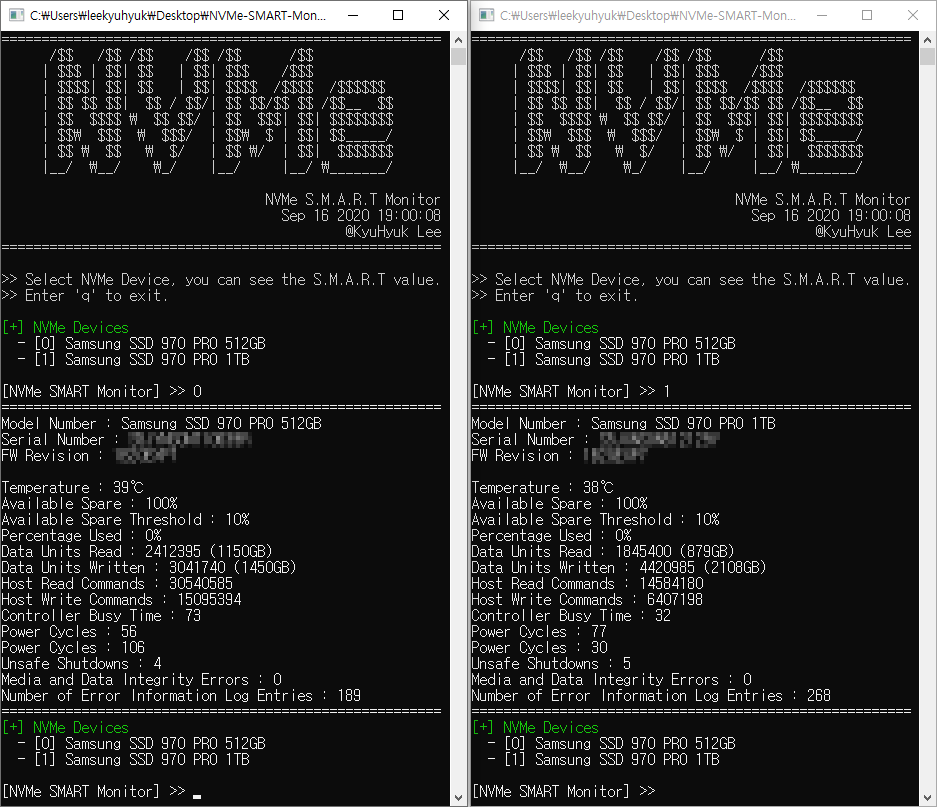

# NVMe S.M.A.R.T Monitor

- **Development Environment**
  - Visual Studio 2019 (v142)
  - Windows SDK Version : 10.0.18362.0

- **Supported Functions :**
  - Print NVMe SSD Identify
  - Print NVMe SSD S.M.A.R.T (Health Data)
